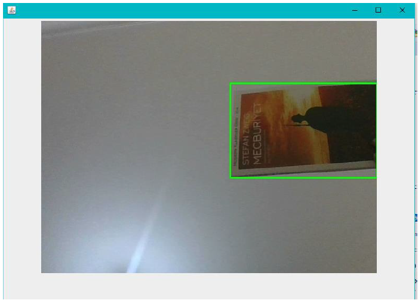

# detection-of-objects-approaching-the-camera

It detects moving objects approaching the camera. The object is detected in the frame when it occupies a specific area. Then the image at the time it was first detected is displayed.

You must change the values according to the resolution of the video device ( in this code, 850). 

 - OpenCV 3.4.1 used.
 - Background Subtractor MOG2 used in OpenCV.

Detected moving object but not close. Rectangle is green.

Detected moving object and it's close more than in the first picture. The current frame was recorded and displayed. Rectange is red.

Thanks to Mesut Pişkin - mesutpiskin.com
